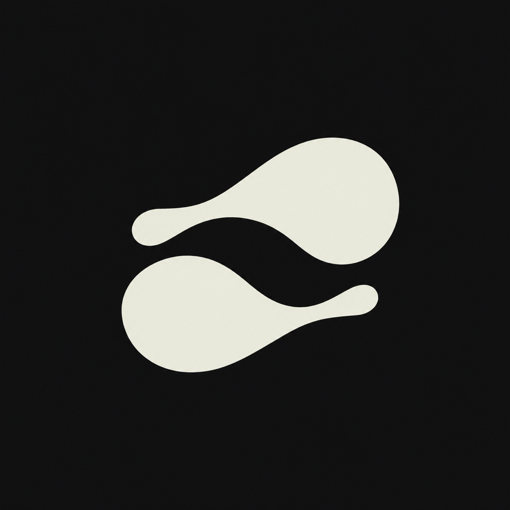
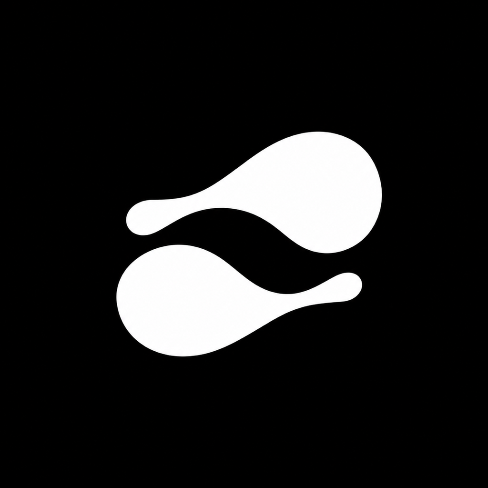
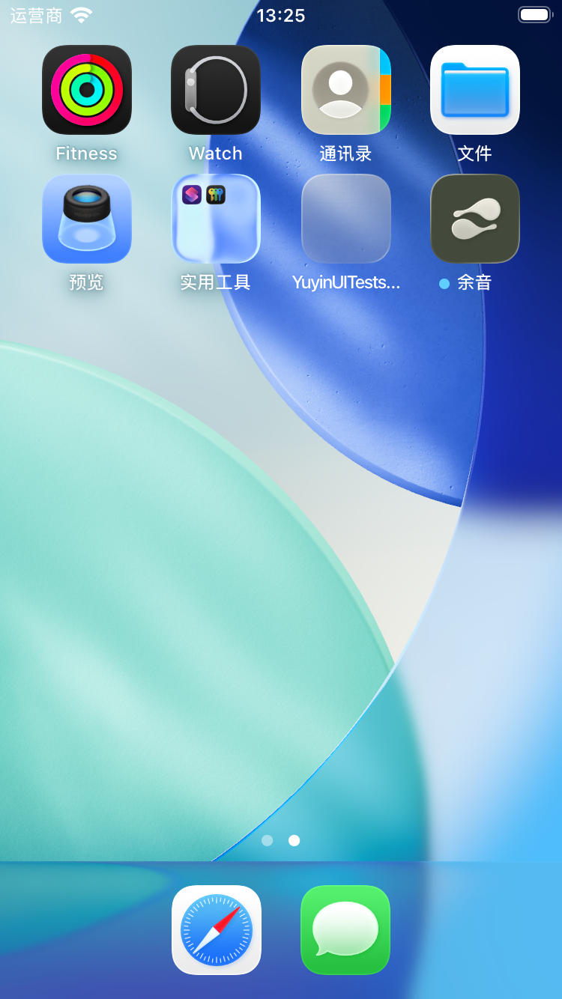
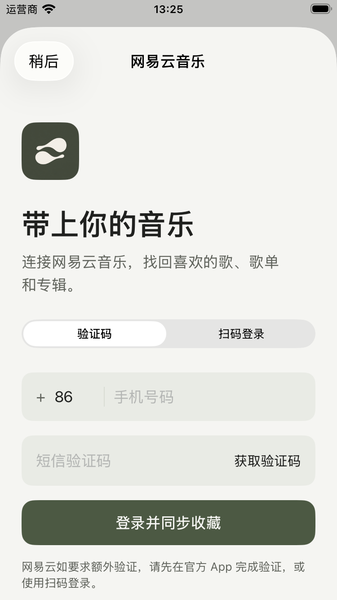

# 余音 · 声音的余韵

两道错位的声影，一道发出，一道回应。形体之间的留白让声音有了停留的空间。

图标沿用应用的灰橄榄与暖白。方形画布保持不透明，圆角由系统处理；浅色、深色和着色外观使用同一个图形。

<table>
  <tr>
    <td align="center"> 默认</td>
    <td align="center"> 深色</td>
    <td align="center"> 着色底稿</td>
  </tr>
</table>

## 小尺寸

<table>
  <tr>
    <td align="center"> 24 pt</td>
    <td align="center"> 32 pt</td>
    <td align="center"> 60 pt</td>
    <td align="center"> 120 pt</td>
  </tr>
</table>

## 资源

- [原始主稿](echo-master.png)：1254 × 1254 PNG。
- [应用图标](../../App/Resources/Assets.xcassets/AppIcon.appiconset)：三种外观，均为 1024 × 1024 不透明 PNG。
- [应用内标识](../../App/Resources/Assets.xcassets/BrandMark.imageset)：登录页面使用的小尺寸资源。

生成主稿后仅按目标像素尺寸导出资源，不另行重绘形状。着色版的最终颜色由用户的系统外观设置决定。

## 系统与应用内展示

<table>
  <tr>
    <td align="center"> 系统主屏幕</td>
    <td align="center"> 应用内</td>
  </tr>
</table>

以上为测试模拟器实拍，未填写账号或发送登录请求。
