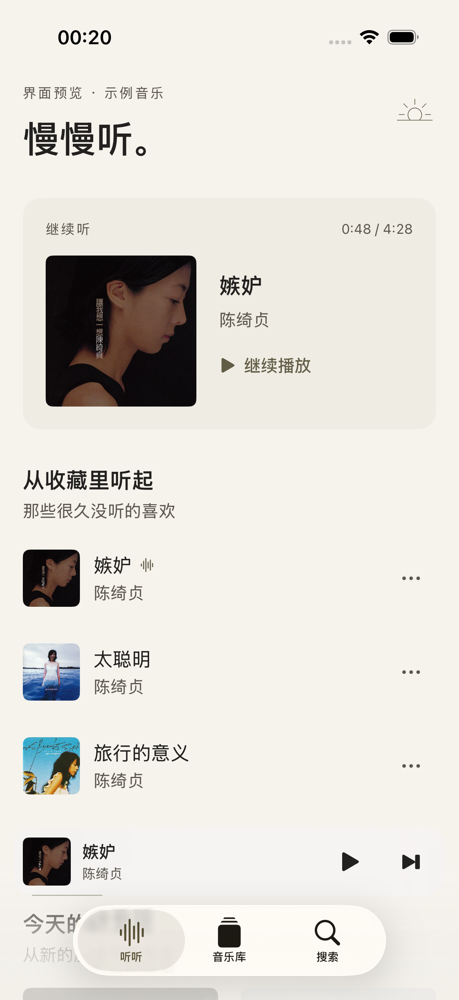
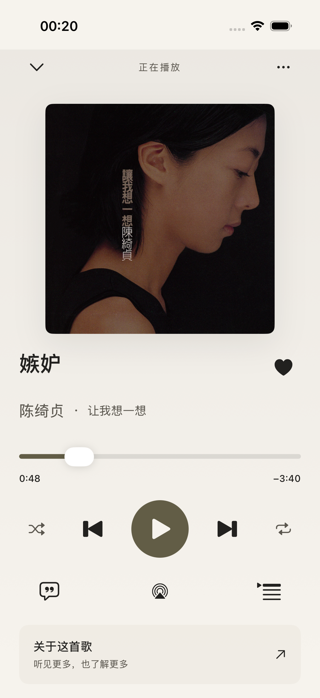
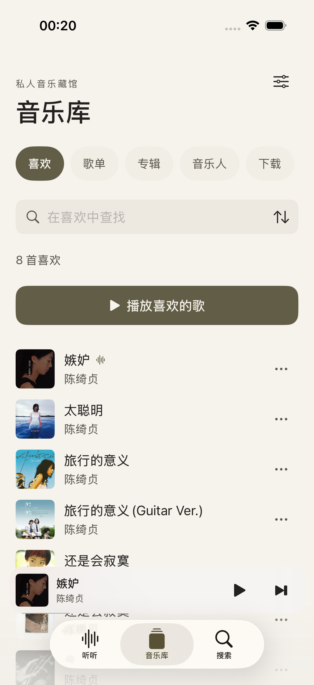
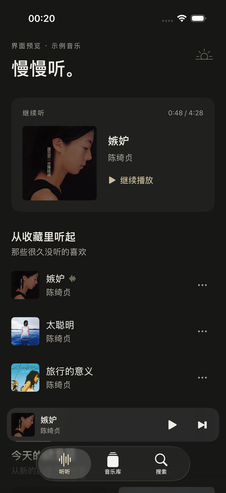
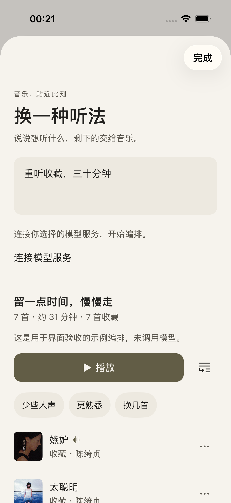
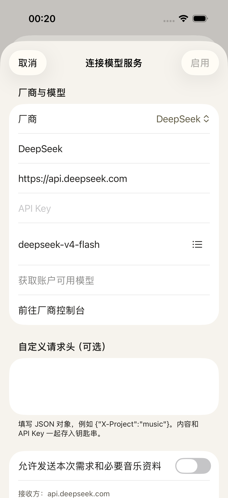

<p align="center">
  
</p>

<h1 align="center">余音</h1>

<p align="center">一座随身的音乐藏馆。</p>
<p align="center">iPhone · iOS 18+ · SwiftUI · 可选 AI</p>

<p align="center">
  <a href="#界面">界面</a> ·
  <a href="#音乐与灵感">功能</a> ·
  <a href="#在-mac-上构建并安装到-iphone">安装到 iPhone</a> ·
  <a href="Docs/DEVELOPMENT.md">开发说明</a>
</p>

余音是一款面向 iPhone 的网易云第三方音乐客户端。从熟悉的收藏开始，让新的音乐自然进入；用完整封面、清晰的文字和适度的留白，把注意力留给音乐。

你可以直接听歌，也可以连接自己的模型服务，让 AI 帮你安排接下来想听的音乐，或了解一首歌背后的资料。

## 界面

<table>
  <tr>
    <td align="center"><br><sub>听听</sub></td>
    <td align="center"><br><sub>播放器</sub></td>
    <td align="center"><br><sub>音乐库</sub></td>
  </tr>
</table>

<details>
<summary>深色外观与 AI</summary>

<table>
  <tr>
    <td align="center"><br><sub>深色外观</sub></td>
    <td align="center"><br><sub>音乐编排</sub></td>
    <td align="center"><br><sub>自己的模型</sub></td>
  </tr>
</table>

</details>

<sub>截图使用演示数据。外观跟随系统，支持动态字体。</sub>

## 音乐与灵感

- **从收藏开始听**：继续上次的队列和进度，重听久未播放的收藏，浏览少量新发现。
- **整理自己的音乐库**：喜欢、歌单、专辑和音乐人；支持搜索、筛选、排序、固定常听内容，以及歌单增删、改名和曲序编辑。
- **顺手的播放器**：完整封面、逐字与逐行歌词、播放队列、随机与循环、定时停止、AirPlay、后台播放和锁屏控制。
- **按心情编排**：用自然语言描述想听什么，预览歌曲和实际时长，再播放、加入队列或保存为歌单；支持继续调整和撤销。
- **了解一首歌**：查看歌曲、专辑和音乐人的资料与来源，阅读简短导读，继续追问或探索相关音乐。
- **选择自己的模型**：支持 DeepSeek、阿里百炼、Kimi、智谱及自定义 OpenAI 兼容接口。模型功能按需启用，API Key 保存在设备 Keychain，请求从手机直接发送到所选服务。

当前为 **0.2.0 开发版本**。离线下载尚未开放；小组件、快捷指令及 CarPlay 的能力边界见 [开发说明](Docs/DEVELOPMENT.md#系统能力)。

## 在 Mac 上构建并安装到 iPhone

### 准备

- 一台安装了完整 **Xcode** 和 iOS 平台支持的 Mac。本项目已使用 Xcode 26.6 构建。
- 一部运行 **iOS 18 或更新版本**的 iPhone。
- 一个已登录 Xcode 的 Apple 账户。个人真机运行可使用 Personal Team。
- 首次连接时使用数据线，解锁 iPhone，并完成“信任此电脑”。

下载源码并打开工程：

```sh
git clone https://github.com/thunguo/resonate.git
cd resonate
open Yuyin.xcodeproj
```

仓库包含可直接打开的 Xcode 工程，首次构建无需安装 XcodeGen。

### 用 Xcode 安装

1. 在 **Xcode → Settings → Apple Accounts** 登录 Apple 账户。
2. 选择 **Yuyin** scheme，打开 **Product → Scheme → Edit Scheme → Run → Info**，将 **Build Configuration** 设为 **PersonalDevice**。
3. 在工程的 **Signing & Capabilities** 中，为 **Yuyin** 和 **YuyinWidget** 两个 target 开启 **Automatically manage signing**，选择同一个 Team。
4. 若默认 Bundle Identifier 不可用，为两个 target 分别设置自己的唯一标识，例如 `org.example.music` 和 `org.example.music.widget`。小组件标识以主 App 标识为前缀。
5. 在 iPhone 的 **设置 → 隐私与安全性 → 开发者模式** 中启用开发者模式，按提示重启并确认。若没有该选项，先在 Xcode 中完成设备配对。
6. 在 Xcode 顶部选择自己的 iPhone 作为运行设备，点击 **Run**（⌘R）。Xcode 会完成签名、构建、安装和启动。

`PersonalDevice` 配置适合个人真机运行，不请求 App Groups 或 CarPlay 权限。它的小组件可打开 App，但不能共享实时播放摘要。

设备配对、签名和开发者模式的详细说明见 Apple 的 [真机运行指南](https://developer.apple.com/documentation/xcode/running-your-app-on-simulated-or-physical-devices) 与 [开发者模式指南](https://developer.apple.com/documentation/xcode/enabling-developer-mode-on-a-device)。

### 用终端构建并推送到手机

首次使用先按上面的步骤完成配对和签名。在项目根目录运行：

```sh
xcrun devicectl list devices
```

记下目标 iPhone 的 `Identifier`。把下面的 Team ID 和设备 ID 替换成自己的值；Team ID 可在 Xcode 的签名账户信息或工程的 `DEVELOPMENT_TEAM` 构建设置中查看。

```sh
YY_TEAM_ID="YOUR_TEAM_ID"
YY_DEVICE_ID="YOUR_DEVICE_ID"

xcodebuild \
  -project Yuyin.xcodeproj \
  -scheme Yuyin \
  -configuration PersonalDevice \
  -destination 'generic/platform=iOS' \
  -derivedDataPath build/DerivedData \
  -allowProvisioningUpdates \
  DEVELOPMENT_TEAM="$YY_TEAM_ID" \
  build

xcrun devicectl device install app \
  --device "$YY_DEVICE_ID" \
  build/DerivedData/Build/Products/PersonalDevice-iphoneos/Yuyin.app

xcrun devicectl device process launch \
  --device "$YY_DEVICE_ID" \
  space.thunguo.yuyin
```

构建得到的 `.app` 是已签名安装包，可直接安装到配对手机。如果修改了主 App 的 Bundle Identifier，请同步替换最后一条命令中的 `space.thunguo.yuyin`。

更新时保持原来的 Team 和 Bundle Identifier，重新构建并覆盖安装。开发签名到期后，需要重新签名安装；有效期以描述文件为准。

<details>
<summary>常见安装问题</summary>

| 情况 | 处理方式 |
| --- | --- |
| 找不到手机，或显示 unavailable | 解锁手机，重新连接数据线，在 Xcode 的设备管理界面完成配对 |
| 提示需要开发者模式 | 在手机上启用开发者模式，完成重启后的再次确认 |
| 提示 App Groups 权限不可用 | 确认 Run 使用 `PersonalDevice`，并且 App 与小组件选择了同一个 Team |
| Bundle Identifier 已被占用 | 为 App 和小组件设置一组自己可用的唯一标识 |
| 提示没有可用的描述文件 | 在 Xcode 中选中真机运行一次，让自动签名注册设备并生成描述文件 |
| 终端找不到 iOS SDK | 在 Xcode 的 Components 中安装 iOS 平台支持，并在 Locations 中选择完整 Xcode 的 Command Line Tools |

</details>

## 开始使用

打开余音，在 **音乐库 → 右上角设置** 登录网易云音乐，等待收藏同步后即可开始听歌。

需要 AI 时，进入 **设置 → 模型服务 → 添加**，选择厂商、填写 API Key 和模型 ID，查看数据范围并测试连接后启用。连接测试会发送少量请求，可能产生调用费用。

默认音乐接口为 [music.thunguo.space](https://music.thunguo.space)，基于 [Enhanced API](https://neteasecloudmusicapienhanced.js.org/)。播放可用性和实际音质取决于账户权限与服务返回的资源。模型服务独立配置，网易云登录凭据不会发送给模型。

## 开发

工程结构、测试命令、预览参数与系统能力说明位于 [开发文档](Docs/DEVELOPMENT.md)。
